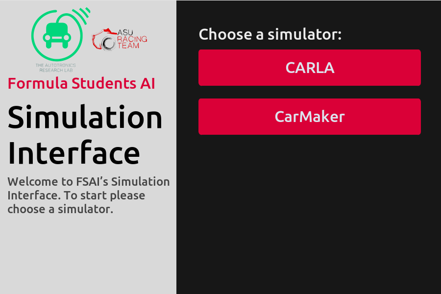
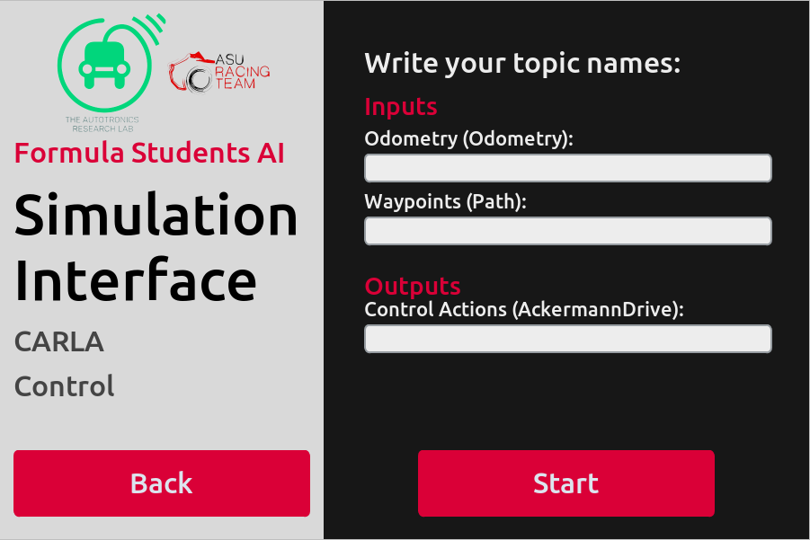

# SimGUI
## Introduction
This is a GUI for FSAI simulations. It has options to test and simulate different modules on different simulators. This GUI is built using CustomTkinter.

## Installation
1. Clone the repository
2. Install the requirements using `pip install -r requirements.txt`
3. Run the GUI using `python App.py`

## Usage
1. Choose the simulator you want to use
2. Choose the module you want to test
3. Write the topic names that you use
4. Click on `Start` to start the simulation

## Supported Simulators
1. CARLA
2. IPG CarMaker

## Screenshots
### Simulator Selection

### Module Selection

### Topic Selection

## License
This project is licensed under the MIT License - see the [LICENSE](LICENSE) file for details

